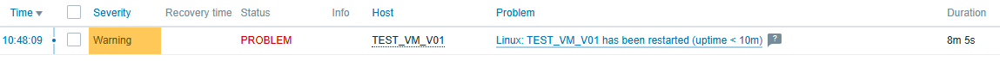

# SOC 監控與事件處理架構實驗室  
### SOC Monitoring & SIEM Architecture Lab

本專案展示一套整合式 Monitoring 與 SIEM 架構模型，  
重建企業 SOC 核心能力，而非單純工具部署。

本 Lab 強調：

- 事件生命週期設計
- 告警工程（Alert Engineering）
- 事件關聯能力
- Root Cause 分析模型
- 長期可持續維運策略

這是一套「分層能力模型」，而不是工具堆疊展示。

---

# 🧭 SOC = 企業資安戰情中心

SOC 可以理解為企業的「資安戰情中心」，  
但真正價值在於：

- 事件是否被完整關聯
- 是否能建立清晰時間軸
- 是否能快速判斷 Root Cause
- 是否具備長期優化能力
- 是否可持續維運

SOC 的核心不是告警數量，而是決策品質。

---

# 🏗 架構總覽（五層能力模型）

本實驗室採用五層架構能力堆疊：

1️⃣ Detection Layer  
Zabbix / Wazuh / Zeek  

2️⃣ Correlation Layer  
Graylog  

3️⃣ Root Cause Analysis Layer  

4️⃣ Trend Validation Layer  
Prometheus  

5️⃣ Operational Sustainability Layer  
Maintenance SOP  

核心理念：

> Monitoring ≠ 工具  
> Monitoring = 分層能力 + 事件生命週期

---

# 🔔 告警 × 關聯架構

設計目標：

- Trigger 產生事件
- Email 通知
- 日誌集中
- 時間軸建立
- 根因分析
- 趨勢驗證
- 長期優化

避免停留在「大量告警」的初階監控模式。

---

# 🔁 Incident Lifecycle Workflow

完整事件流程：

Detection  
→ Notification  
→ Correlation  
→ Root Cause  
→ Trend Validation  
→ Optimization  

確保每個事件都有完整生命週期，而非孤立存在。

---

# 🔧 Zabbix Alert Engineering 展示

實作能力包含：

- CPU / Load 門檻告警
- Agent 存活監控
- Service restart 偵測
- VM uptime 重新啟動偵測
- Problem / Recovery 狀態追蹤
- Downtime 計算
- Email 通知機制

重點不是「有告警」，  
而是：

- 是否有完整事件紀錄
- 是否有恢復時間
- 是否可量化可用性

---

# 📊 Availability & Performance Monitoring Matrix

| 類型 | 監控項目 | 架構意義 |
|------|----------|----------|
| Performance | CPU / Load | 系統效能監控 |
| Availability | Agent Down | 監控可用性 |
| Infrastructure | Server Restart | 基礎設施穩定度 |
| Lifecycle | Uptime < 10m | 主機重啟偵測 |

此模型確保監控具有策略性，而非隨機設定 Trigger。

---

# 🔗 Zabbix × Graylog 關聯展示

流程：

1. Zabbix 偵測異常  
2. 發送通知  
3. Graylog 收集相關日誌  
4. 建立完整時間軸  
5. 協助判斷是否為 Crash / Manual Restart / Attack Chain  

這層設計避免「單點告警孤立存在」。

---

# 📷 Live Demonstration Screenshots

## Zabbix Event Details
(放置實際 Event Details 截圖)

## Problem & Recovery Timeline
(放置 Problem / Recovery 畫面)

## Email Alert Sample
(放置 Email 通知截圖)

本 Lab 為實際運行環境截圖展示。

---

# ⚠ 為什麼許多 SOC 會失敗？

- Alert fatigue
- 缺乏事件關聯能力
- 工具堆疊但沒有分層
- 沒有長期維運策略
- 缺乏持續優化機制

SOC 失敗通常不是技術不足，而是架構思維不足。

---

# 💡 本專案的設計思路

- 分層責任清楚
- 事件生命週期模型
- 關聯與時間軸優先
- Alert Engineering 設計
- 維運節奏制度化

---

# 📈 Monitoring Maturity Model

Level 1 – Basic Monitoring  
單純 CPU / Memory 門檻告警  

Level 2 – Event Tracking  
Problem / Recovery 事件紀錄  

Level 3 – Alert Engineering  
通知機制、降噪、維護窗口  

Level 4 – Availability Design  
Agent / Restart / Uptime 偵測  

Level 5 – Full SOC Integration  
監控 × 日誌 × 趨勢 × RCA 關聯模型  

---

# 🛠 Maintenance SOP

每日：
- 監控健康檢查
- 關鍵錯誤掃描

每週：
- 告警降噪
- Trigger 優化
- 日誌 retention 檢查

每月：
- 容量規劃
- Graylog pipeline 優化
- 趨勢分析報告

每季：
- 升級演練
- 備份與還原驗證
- 架構回顧與優化

---

# 🖥 Lab 環境

- Ubuntu VM 架構
- Zabbix Server
- Wazuh
- Graylog
- Zeek
- Prometheus

可依企業規模進行橫向擴充。

---

# 📷 Live Demonstration

## Event Lifecycle Evidence

此畫面顯示：
- Problem 產生
- Resolved 時間
- Duration 計算
- 事件完整生命週期

---

## Alert Engineering View

此畫面展示：
- Severity 分級
- 問題狀態
- Duration 計算
- Tag 分類
- Timeline 支援

# 🧠 Architecture Philosophy

Many SOC deployments fail not because of technology,  
but because of architectural thinking.

Stacking tools is easy.  
Designing lifecycle-driven systems is difficult.

This lab is built around three core beliefs:

1. Monitoring must support decision-making.
2. Every alert must have context.
3. Sustainability is more important than complexity.

A good SOC is not the one with the most alerts.  
It is the one with the clearest understanding.

---

# 🌍 English Summary

This repository demonstrates a layered SOC monitoring architecture  
focused on:

- Event lifecycle modeling
- Alert engineering
- Correlation capability
- Root cause analysis
- Long-term operational sustainability

It rebuilds SOC core capabilities from first principles  
instead of stacking tools without architectural design.
