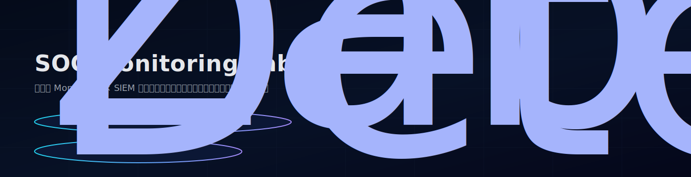
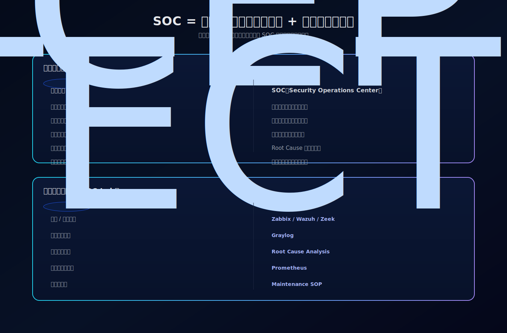

# SOC 監控與事件處理架構實驗室  
### SOC Monitoring & SIEM Architecture Lab

本專案展示一套整合式 Monitoring 與 SIEM 架構模型，  
強調「事件生命週期設計」、「事件關聯能力」與「長期可持續維運」的架構思維。

這不是單純工具部署，而是重建 SOC 核心能力的實驗室。

---

# 🧭 SOC = 企業資安戰情中心

SOC 可以理解為企業的「資安戰情中心」，  
但真正的價值不只是即時告警，而是：

- 事件如何被關聯
- 是否能建立完整時間軸
- 是否能快速判斷 Root Cause
- 是否能長期優化監控策略
- 是否具備可持續維運能力

---

# 🏗 架構總覽（五層能力模型）

本實驗室以五層能力堆疊設計：

1️⃣ Detection – Zabbix / Wazuh / Zeek  
2️⃣ Correlation – Graylog  
3️⃣ Root Cause Analysis  
4️⃣ Trend Validation – Prometheus  
5️⃣ Operational Sustainability – Maintenance SOP  

核心理念：  
監控 ≠ 工具  
監控 = 能力分層 + 事件生命週期

---

# 🔔 告警 × 關聯架構

設計重點：

- Trigger 產生告警
- Email 通知
- 日誌集中與時間軸建立
- 根因判斷
- 趨勢驗證
- 長期優化

避免只停留在「告警很多」的初階監控。

---

# 🔁 Incident Lifecycle Workflow

完整流程模型：

Detection → Notification → Correlation → Root Cause → Trend & Optimize

此模型確保每個事件都有完整生命週期，而不是單次告警。

---

# 🔧 Zabbix 功能展示（Alert Engineering）

實作能力：

- Agent 存活監控
- Service restart 偵測
- VM uptime 重新啟動偵測
- Problem / Recovery 狀態追蹤
- Downtime 計算
- Email 通知機制

重點不是「有告警」，  
而是是否有完整事件紀錄與恢復時間。

---

# 📊 Availability & Performance Monitoring Matrix

| 類型 | 監控項目 | 架構意義 |
|------|----------|----------|
| Performance | CPU / Load | 系統效能監控 |
| Availability | Agent Down | 監控可用性 |
| Infrastructure | Server Restart | 基礎設施穩定度 |
| Lifecycle | Uptime < 10m | 主機重啟偵測 |

---

# 🔗 Zabbix × Graylog 關聯展示

1. Zabbix 偵測異常  
2. 發送通知  
3. Graylog 收集相關日誌  
4. 建立完整時間軸  
5. 協助判斷是否為 Crash / Manual Restart / Attack Chain  

這層設計避免「單點告警孤立存在」。

---

# ⚠ 為什麼許多 SOC 會失敗？

- Alert fatigue
- 缺乏事件關聯能力
- 工具堆疊但沒有分層設計
- 沒有長期維運策略
- 沒有回顧與優化節奏

SOC 失敗通常不是技術問題，而是架構思維問題。

---

# 💡 本專案的設計思路

- 分層責任清楚
- 事件生命週期模型
- 關聯與時間軸優先
- 告警工程（Alert Engineering）
- 維運節奏設計

---

# 📈 Monitoring Maturity Model

Level 1 – Basic Monitoring  
僅 CPU / Memory 門檻告警  

Level 2 – Event Tracking  
Problem / Recovery 事件紀錄  

Level 3 – Alert Engineering  
通知機制、降噪、維護窗口  

Level 4 – Availability Design  
Agent / Restart / Uptime 偵測  

Level 5 – SOC Integration  
監控 × 日誌 × 趨勢 × RCA 關聯模型  

---

# 🛠 Maintenance SOP

每日：
- 監控健康檢查
- Error log 快速掃描

每週：
- 告警降噪
- Trigger 調整
- Retention 檢查

每月：
- 容量與索引優化
- Graylog pipeline 檢視

每季：
- 升級演練
- 備份與還原驗證
- 架構回顧優化

---

# 🖥 Lab 環境架構

- Zabbix Server
- Wazuh
- Graylog
- Zeek
- Prometheus
- Ubuntu VM 架構

可依企業規模進行橫向擴充。

---

# 🌍 English Summary

This repository demonstrates a layered SOC monitoring architecture  
focusing on:

- Event lifecycle modeling
- Alert engineering
- Correlation capability
- Root cause analysis
- Long-term operational sustainability

It rebuilds SOC core capabilities from first principles  
instead of stacking tools without architectural thinking.
