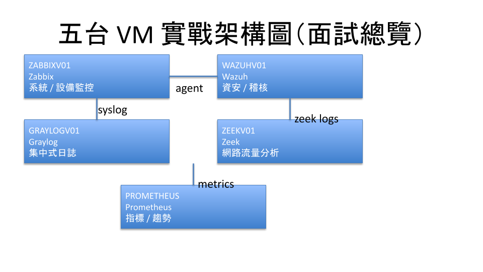

# SOC Monitoring Lab

An architect-level SOC monitoring lab demonstrating how availability,
security visibility, network analysis, and incident forensics
can be integrated into a single operational model.

## Architecture Overview

## Architecture Design

This lab is designed as a three-layer integrated Monitoring and SIEM architecture.

**Detection & Monitoring Layer**  
Zabbix, Wazuh, and Zeek focus on detecting availability issues, host-level security events,
and network behavior anomalies from different perspectives.

**Event & Forensics Layer**  
Graylog acts as the central event hub, aggregating logs and security events into a
correlatable timeline for incident investigation and root cause analysis.

**Trends & Capacity Layer**  
Prometheus provides long-term metrics and trend visibility, supporting capacity planning
and distinguishing transient anomalies from systemic issues.

This layered design ensures clear responsibility separation, reduced alert fatigue,
and long-term maintainability.

### Core Components
- **Zabbix** – Availability and service monitoring
- **Wazuh** – Host-based security monitoring and auditing
- **Zeek** – Network traffic and behavior analysis
- **Graylog** – Centralized logging and incident forensics
- **Prometheus** – Performance trends and capacity planning
- **EDR** – Real-time endpoint detection and response

## Incident Workflow

### Example Scenarios
1. Zabbix detects abnormal system or service behavior  
2. Wazuh / EDR identify suspicious host activity  
3. Zeek provides network-level evidence  
4. Graylog correlates events into a unified timeline  
5. Prometheus validates long-term trends vs. anomalies  

## Design Principles
- One tool, one responsibility
- Correlatable and traceable incidents
- Focus on long-term maintainability and handover readiness

## Maintenance SOP (High-Level)
- Daily: platform health checks
- Weekly: alert quality review and noise reduction
- Monthly: retention and capacity review
- Quarterly: upgrades and restore drills
