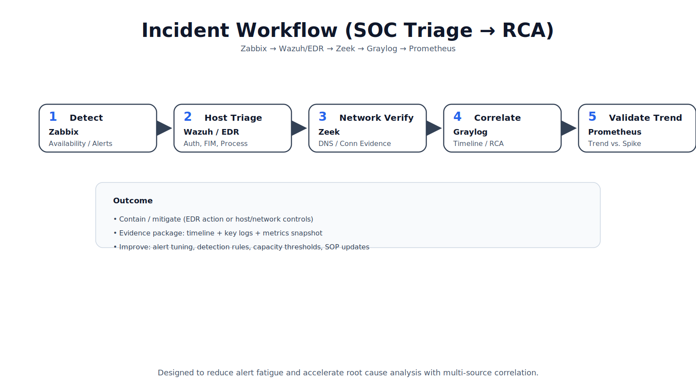

# SOC 監控與事件處理架構實驗室  
### SOC Monitoring & SIEM Architecture Lab

本專案展示一套整合式 Monitoring 與 SIEM 架構，
強調系統穩定性、資安可視性、事件關聯能力，
以及長期可維運與可交接的設計思維。

---

## 🏗 架構總覽

---

## 🎯 架構設計理念

本架構採用三層式設計：

### 第一層：偵測與監控層（Detection Layer）
- **Zabbix**：系統與服務可用性監控  
- **Wazuh**：主機層資安監控與稽核分析（HIDS）  
- **Zeek**：網路行為與流量分析  

負責從不同視角發現異常。

---

### 第二層：事件與鑑識層（Forensics Layer）
- **Graylog**：集中式日誌與事件時間軸關聯  

將多來源事件整合為可回溯的 Incident Timeline，
支援 Root Cause Analysis。

---

### 第三層：趨勢與容量層（Trend Layer）
- **Prometheus**：效能趨勢觀察與容量規劃  

協助區分偶發事件與長期資源問題。

---

## 🔁 事件處理流程

### 範例流程

1. Zabbix 偵測系統或服務異常  
2. Wazuh / EDR 分析主機行為  
3. Zeek 提供網路層證據  
4. Graylog 建立完整事件時間軸  
5. Prometheus 判斷是否為長期趨勢問題  

---

## ⚠ 為什麼許多 SOC 會失敗？

許多企業導入 SOC 工具後仍面臨：

- 告警過多導致 Alert Fatigue  
- 缺乏事件關聯能力  
- 工具導向而非架構導向  
- 沒有長期維運與調校策略  

本專案著重於：

- 分層責任設計  
- 清楚資料流  
- 可回溯事件模型  
- 可持續維運機制  

---

## 🛠 維運節奏（Maintenance SOP）

- 每日：平台健康檢查（服務 / 磁碟 / 資源）  
- 每週：告警品質調整與降噪  
- 每月：Retention 與容量檢視  
- 每季：升級與還原演練  

---

# English Summary

This repository demonstrates a layered SOC monitoring architecture
focusing on event correlation, incident investigation,
and long-term operational sustainability.

It is designed as an architectural prototype
rather than a commercial SOC product replacement.
