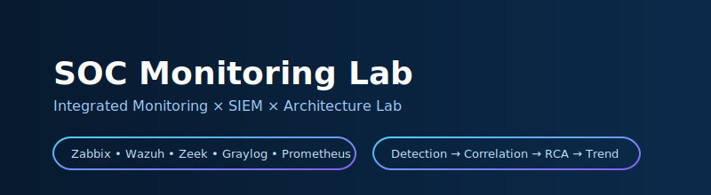
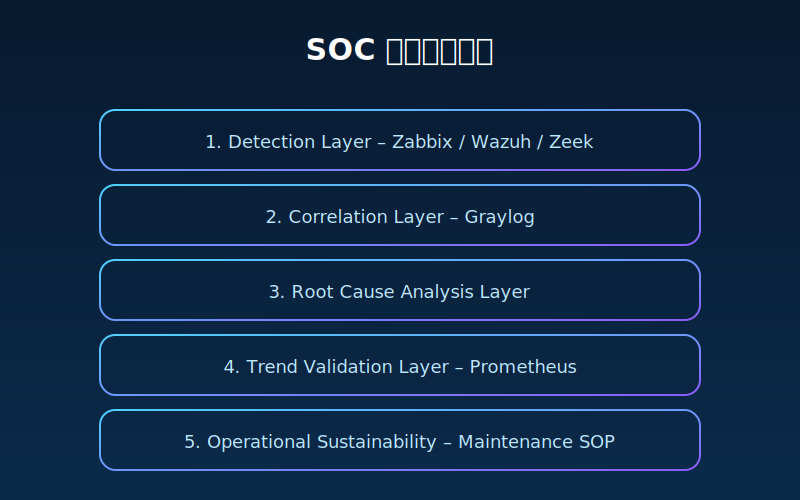
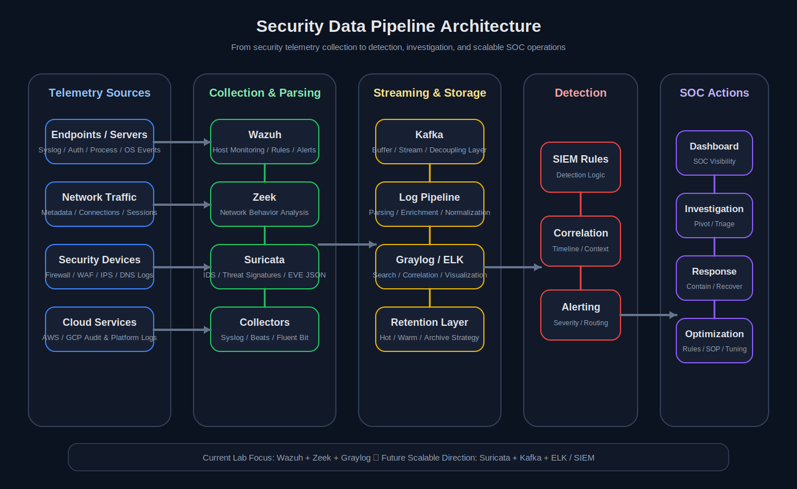
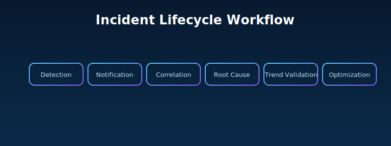

<p align="center">
  
</p>

# SOC 監控與事件處理架構實驗室

### SOC Monitoring Architecture Lab

本專案展示一套 **SOC（Security Operations Center）監控架構模型**，
重點在於監控架構設計與事件生命週期，而非單純展示工具部署。

本 Lab 強調：

* 事件生命週期設計（Incident Lifecycle）
* 告警工程（Alert Engineering）
* 日誌關聯能力（Log Correlation）
* Root Cause 分析
* 長期可持續維運策略

> 這是一套「分層能力模型」，而非單純的工具堆疊展示。

---

# 架構快速總覽

## SOC 監控架構

### SOC Monitoring Architecture

<p align="center">
  
</p>

*Figure 1 – SOC 分層監控架構模型*

此架構展示企業環境中監控系統、日誌分析平台與維運流程如何協同運作，
形成可持續運行的 SOC 監控體系。

核心架構流程：

```
Log Sources
↓
Detection Layer
↓
SIEM Analysis
↓
Root Cause Analysis
↓
Operational Sustainability
```

---

## 資安監控資料流程

### Security Monitoring Pipeline

<p align="center">
  
</p>

*Figure 2 – 安全監控資料處理流程*

此圖展示安全日誌如何從各個系統收集，
經過集中分析後轉換為可用的安全告警。

資料流程：

```
Log Sources
→ Wazuh / Zeek
→ Graylog SIEM
→ Alert
→ Investigation
```

---

## 事件處理流程

### Incident Detection Workflow

<p align="center">
  
</p>

*Figure 3 – SOC 事件處理生命週期*

SOC 的核心能力在於建立完整的事件處理流程，
從告警產生到問題分析與後續優化。

事件生命週期：

```
Detection
→ Notification
→ Correlation
→ Investigation
→ Root Cause
→ Recovery
→ Optimization
```

---

# SOC 核心概念

SOC（Security Operations Center）可以理解為企業的資安戰情中心。

SOC 的價值並不在於產生多少告警，而在於是否具備：

* 事件關聯能力
* 時間軸重建能力
* Root Cause 分析能力
* 持續優化監控策略的能力

本 Lab 著重於 **SOC 架構思維**，
而非僅展示工具安裝與設定。

---

# SOC 運作模型

成熟的 SOC 通常包含以下流程：

```
Monitoring
→ Alerting
→ Investigation
→ Root Cause Analysis
→ Recovery
→ Continuous Improvement
```

SOC 的目標不只是偵測問題，
更重要的是持續優化監控系統與降低事件影響。

---

# 監控成熟度模型

SOC 監控能力可分為多個成熟階段：

**Level 1 – Basic Monitoring**
基礎 CPU / Memory 門檻監控

**Level 2 – Event Tracking**
記錄 Problem / Recovery 事件

**Level 3 – Alert Engineering**
告警優化、降噪、維護窗口

**Level 4 – Availability Monitoring**
基礎設施可用性監控

**Level 5 – Full SOC Integration**
監控、日誌、關聯與事件生命週期整合

---

# Lab 環境

本實驗室使用多種開源工具模擬企業 SOC 環境：

* Ubuntu Server
* Wazuh
* Zeek
* Graylog
* Zabbix

透過這些工具整合，
展示企業監控系統如何進行日誌收集、分析與事件處理。

---

# Security Data Pipeline 思考

在大型企業環境中，
監控系統通常需要處理大量日誌資料。

常見架構會演進為完整的 Security Data Pipeline：

```
Sensors
(Wazuh / Zeek)

↓

Log Collectors
(Syslog / Agents)

↓

Streaming Layer
(Kafka / Message Queue)

↓

Analysis Platform
(ELK / SIEM)

↓

Detection / Investigation
```

此架構可以提升：

* 系統擴充性
* 日誌處理效率
* 監控系統穩定性

---

# 未來架構探索

未來此 Lab 可能延伸至：

* Kafka-based log streaming
* ELK-based SIEM architecture
* Advanced correlation pipelines
* Automated detection systems

目標是模擬更大型的 SOC 環境。

---

# Repository Structure

```
soc-monitoring-lab
│
├─ README.md
├─ images/
└─ screenshots/
```

---

# 關鍵字

SOC monitoring
SIEM architecture
security monitoring
log correlation
alert engineering
incident lifecycle

---

# 作者

Austin

Infrastructure Monitoring / SOC Architecture Lab
