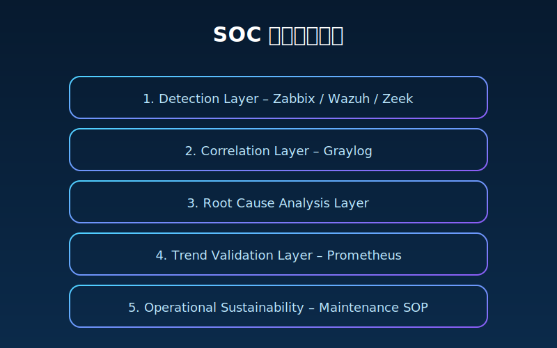
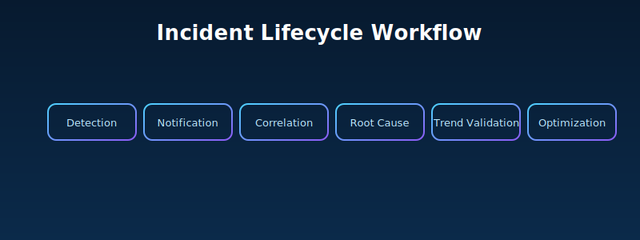

# SOC Monitoring & SIEM Architecture Lab

> Rebuilding SOC capabilities from first principles.

---

## 🧭 Architecture Overview

---

## 🔁 Incident Lifecycle

---

## 🔔 Alert Engineering Model

---

## 🎯 Design Philosophy

A SOC should not be tool-driven.  
It should be lifecycle-driven.

Detection → Correlation → Root Cause → Optimization

Monitoring is not about alerts.  
Monitoring is about understanding system behavior over time.

---

## 🛠 Core Components

- Zabbix – Infrastructure Monitoring
- Wazuh – Endpoint Security
- Graylog – Log Correlation
- Zeek – Network Visibility
- Prometheus – Trend Validation

---

## 📈 Maturity Model

Level 1 – Basic Monitoring  
Level 2 – Event Tracking  
Level 3 – Alert Engineering  
Level 4 – Availability Design  
Level 5 – Full SOC Integration  

---

## 🌍 English Summary

This lab demonstrates a layered SOC architecture model  
focused on event lifecycle, alert engineering and sustainability.
